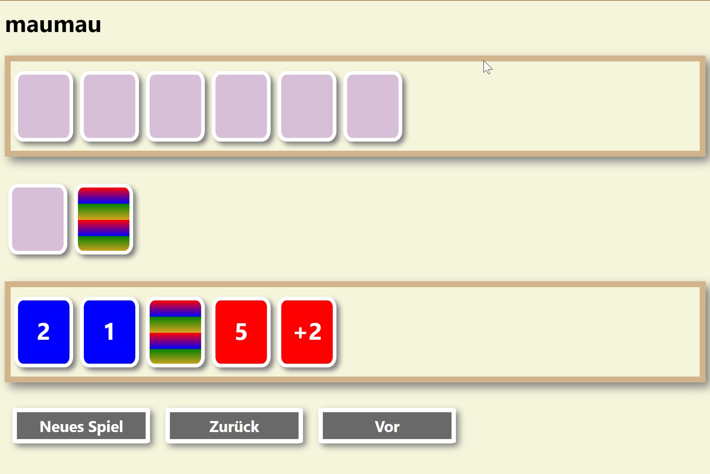

# maumau
Simples MauMau Spiel für zwei Spieler.

Dieses Spiel wurde im Zuge des Social Distancings entwickelt, sodass Kinder auch mit ihren Großeltern maumau spielen können. Das Spiel läuft auf einem Server, der über Websockets sich mit den Clients verbindet. 

## Definitionen

### Stapel

Der Stapel das sind die gemischten Karten. Vom Stapel ziehen die Spieler immer die oberste Karte.

### Haufen

Auf den Haufen werden die unterschiedlichen Karten abgelegt. Dabei dürfen nur bestimmte Karten auf den Stapel gelegt werden.

## Events

Für die Umsetzung werden verschiedene Events definiert. 

- [x] newGame: Neues Spiel
- [x] Erste Karte Aufdecken
- [x] newPlayer(name): Spieler hinzufügen
- [x] pushCardToStack: Karte auf den Stapel legen (wird nach dem Mischen der Karten verwendet)
- [x] setActivePlayer: Spieler am Zug
- [x] playerReady: Spieler ist fertig mit dem Zug
- [x] popCardFromStack: Spieler nimmt oberste Karte vom Stapel
- [x] pushCardToHeap: Spieler legt Karte auf den Haufen
- [ ] gameOver: Spieler hat gewonnen

## GUI

Umsetzung erfolg über HTML

- [x] HTML Template Struktur
- [x] vue.js Rendering via JSON Input
- [x] Anbindung an Wesocket
- [x] Abfangen von nicht gültigen Zügen
- [x] Anmeldebildschirm
- [x] Undo und Redo
- [x] Neues Spiel

Definition der einzelnen Phasen für den Client

- [ ] Status: Warte Anmeldung Partner
- [ ] Status: Warte auf Zug
- [ ] Status: Spiele Karte
- [ ] Status: Nimm eine Karte
- [ ] Status: Wähle Farbe

## Server

- [x] Game State für Spieler
- [x] Game Start
- [x] Validierung der Züge 
- [x] Undo und Redo Handler
- [x] Neues Spiel Handler

## embed-Erweiterung

Im Zuge von Go 1.16 wurden alle lokalen HTML-Files nun mittels embed-Paket in das Binary aufgenommen.